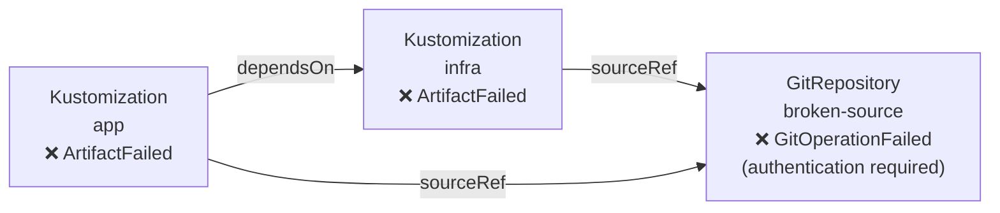
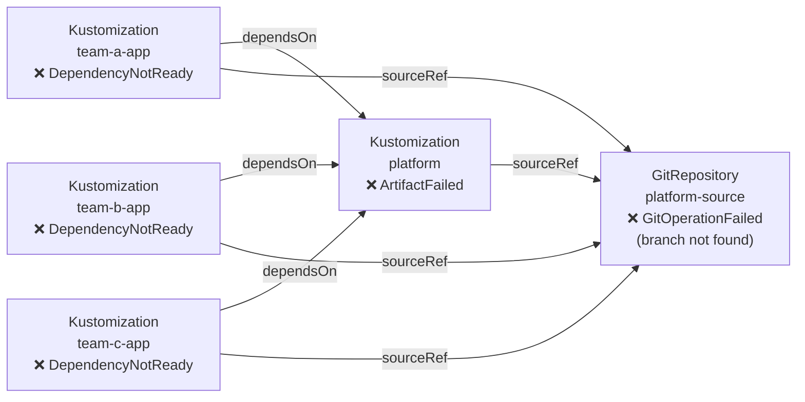
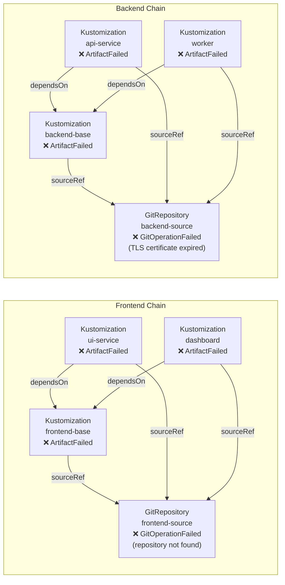
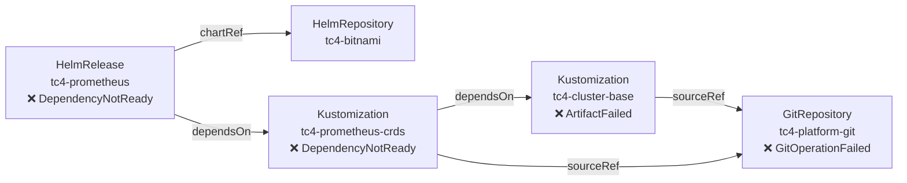
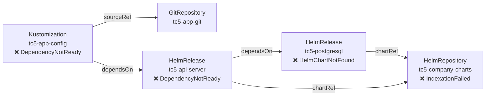
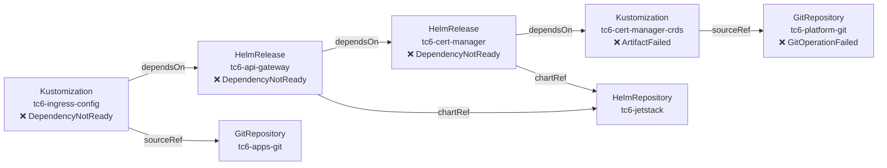

# Test Cases

Iteration 2 cases (1–3) cover pure Kustomization chains. Iteration 3 cases (4–6) introduce HelmRepositories and HelmReleases. All scripts are in `test/`.

---

## Iteration 2

---

## Test Case 1: Broken Source — Linear Chain

### Scenario

A GitRepository's deploy key has been rotated but the Flux secret has not been updated. Authentication fails on every sync attempt. A single Kustomization depends on this source; a second Kustomization depends on the first and also references the same source directly.

This is the most common Flux failure pattern: a single broken source causes a short linear cascade.

### Object Graph



### Failure State

```
NAME    READY   REASON              MESSAGE
infra   False   ArtifactFailed      Source artifact not found, retrying in 30s
app     False   ArtifactFailed      Source artifact not found, retrying in 30s
```

```
NAME            READY   REASON               MESSAGE
broken-source   False   GitOperationFailed   authentication required
```

### Expected Controller Output

One notification group fires (root cause: `broken-source`). `infra` and `app` reconcile near-simultaneously but the second is suppressed by the dedup window.

```json
{ "msg": "root cause", "details": {
    "trigger":  "app",
    "object":   "broken-source",
    "kind":     "GitRepository",
    "reason":   "GitOperationFailed",
    "message":  "authentication required",
    "duration": "~30s"
}}

{ "msg": "affected chain",
  "chain": "app(Kustomization) → infra(Kustomization) → broken-source(GitRepository)" }

{ "msg": "warning event", "object": "broken-source", "reason": "GitOperationFailed", "count": 1 }
```

### What This Validates

- Root cause correctly identified as the `GitRepository`, not the downstream `ArtifactFailed` Kustomizations
- Linear `dependsOn` + `sourceRef` traversal builds the correct 3-node graph
- Dedup collapses two reconciles into one notification

---

## Test Case 2: Shared Infrastructure Breakdown — Fan-Out

### Scenario

A platform team manages a shared `platform` Kustomization that bootstraps cluster-wide infrastructure (namespaces, RBAC, CRDs). Three separate application teams' Kustomizations each declare `dependsOn: platform`. The platform's source repository has had its main branch deleted.

Five objects fail simultaneously. This tests the controller's ability to correctly handle a fan-out topology without producing duplicate notifications or duplicate nodes in the graph.

### Object Graph



### Failure State

```
NAME          READY   REASON               MESSAGE
platform      False   ArtifactFailed       Source artifact not found, retrying in 30s
team-a-app    False   DependencyNotReady   dependency 'flux-system/platform' is not ready
team-b-app    False   DependencyNotReady   dependency 'flux-system/platform' is not ready
team-c-app    False   DependencyNotReady   dependency 'flux-system/platform' is not ready
```

### Expected Controller Output

One notification group (root cause: `platform-source`). All four failing Kustomizations reconcile; the first through notifies, the rest are suppressed. The `platform-source` node appears once in the graph despite being reachable via four different paths.

```json
{ "msg": "root cause", "details": {
    "trigger":  "team-a-app",
    "object":   "platform-source",
    "kind":     "GitRepository",
    "reason":   "GitOperationFailed",
    "message":  "branch not found",
    "duration": "~30s"
}}

{ "msg": "affected chain",
  "chain": "team-a-app(Kustomization) → platform(Kustomization) → platform-source(GitRepository)" }

{ "msg": "warning event", "object": "platform-source", "reason": "GitOperationFailed", "count": 1 }
```

### What This Validates

- `visited` map prevents `platform-source` appearing multiple times despite being reachable via 4 paths
- 4 reconcile events collapse to 1 notification via root-cause dedup
- `DependencyNotReady` Kustomizations are still captured as nodes, but the root cause points at the source
- Blast radius (`chain`) correctly shows the full 3-node path

---

## Test Case 3: Simultaneous Independent Failures — Two Chains

### Scenario

Two completely independent platform teams each have their own source repository. Both break at the same time for different reasons: the frontend source repository URL has changed (404), and the backend source has an expired TLS certificate. The failures are unrelated and should produce two independent notification groups.

This tests that the dedup key is per-root-cause and that two chains running in the same namespace don't bleed into each other.

### Object Graph



### Failure State

```
NAME             READY   REASON               MESSAGE
frontend-base    False   ArtifactFailed       Source artifact not found, retrying in 30s
ui-service       False   ArtifactFailed       Source artifact not found, retrying in 30s
dashboard        False   ArtifactFailed       Source artifact not found, retrying in 30s
backend-base     False   ArtifactFailed       Source artifact not found, retrying in 30s
api-service      False   ArtifactFailed       Source artifact not found, retrying in 30s
worker           False   ArtifactFailed       Source artifact not found, retrying in 30s
```

```
NAME              READY   REASON               MESSAGE
frontend-source   False   GitOperationFailed   repository not found: 404
backend-source    False   GitOperationFailed   tls: certificate has expired
```

### Expected Controller Output

Two notification groups, one per root cause. Frontend and backend notifications fire independently.

```json
{ "msg": "root cause", "details": {
    "object":   "frontend-source",
    "kind":     "GitRepository",
    "reason":   "GitOperationFailed",
    "message":  "repository not found: 404"
}}
{ "msg": "affected chain",
  "chain": "ui-service(Kustomization) → frontend-base(Kustomization) → frontend-source(GitRepository)" }
{ "msg": "warning event", "object": "frontend-source", "reason": "GitOperationFailed" }

{ "msg": "root cause", "details": {
    "object":   "backend-source",
    "kind":     "GitRepository",
    "reason":   "GitOperationFailed",
    "message":  "tls: certificate has expired"
}}
{ "msg": "affected chain",
  "chain": "api-service(Kustomization) → backend-base(Kustomization) → backend-source(GitRepository)" }
{ "msg": "warning event", "object": "backend-source", "reason": "GitOperationFailed" }
```

### What This Validates

- Two independent root causes produce two independent notification groups
- Chains do not bleed into each other (frontend nodes never appear in backend chain and vice versa)
- Dedup key is per-root-cause: suppressing `frontend-source` duplicates does not suppress `backend-source` notifications
- Controller handles 6 simultaneous failing Kustomizations and correctly partitions them

---

## Iteration 3

These cases define the acceptance criteria for iteration 3. In all three, HelmReleases and Kustomizations appear in the **same dependency chain** — the way they are actually deployed in production, where platform bootstrap Kustomizations gate application HelmReleases, databases deployed via Helm gate application config Kustomizations, and so on.

Key new traversal requirements:
- HelmRelease chart source is at `spec.chart.spec.sourceRef`, one level deeper than Kustomization's `spec.sourceRef`
- HelmRelease `spec.dependsOn` can reference Kustomizations as well as other HelmReleases
- Kustomization `spec.dependsOn` can reference HelmReleases as well as other Kustomizations
- HelmRelease conditions use different reason strings: `HelmChartNotFound`, `InstallFailed`, `DependencyNotReady`

---

## Test Case 4: GitRepository Failure Cascades Through Two Kustomizations into a HelmRelease

### Scenario

A platform team manages cluster bootstrap in two layers: `tc4-cluster-base` installs namespaces and RBAC, then `tc4-prometheus-crds` installs the Prometheus Operator CRDs (depends on `tc4-cluster-base` being ready). A HelmRelease `tc4-prometheus` deploys the kube-prometheus-stack chart from Bitnami and can only install once the CRDs exist, so it declares `dependsOn: tc4-prometheus-crds`. Both Kustomizations source from the same platform GitRepository. When that GitRepository loses authentication, `tc4-cluster-base` fails immediately, which blocks `tc4-prometheus-crds`, which blocks `tc4-prometheus`.

This is the standard cluster bootstrap pattern: ordered Kustomization layers gate Helm application deployments.

### Object Graph



### Failure State

```
NAME                   READY   REASON               MESSAGE
tc4-cluster-base       False   ArtifactFailed       Source artifact not found, retrying in 30s
tc4-prometheus-crds    False   DependencyNotReady   dependency 'flux-system/tc4-cluster-base' is not ready
tc4-prometheus         False   DependencyNotReady   dependency 'flux-system/tc4-prometheus-crds' is not ready
```

```
NAME                READY   REASON               MESSAGE
tc4-platform-git    False   GitOperationFailed   authentication required
```

### Expected Controller Output

One notification group. Three objects reconcile as failed; all share the same root cause key so only one notification fires.

```json
{ "msg": "root cause", "details": {
    "object":   "tc4-platform-git",
    "kind":     "GitRepository",
    "reason":   "GitOperationFailed",
    "message":  "authentication required"
}}

{ "msg": "affected chain",
  "chain": "tc4-prometheus(HelmRelease) → tc4-prometheus-crds(Kustomization) → tc4-cluster-base(Kustomization) → tc4-platform-git(GitRepository)" }

{ "msg": "warning event", "object": "tc4-platform-git", "reason": "GitOperationFailed" }
```

### What This Validates

- HelmRelease `spec.dependsOn` pointing at a Kustomization is traversed (cross-type edge)
- Traversal continues recursively through the Kustomization chain: `tc4-prometheus-crds` → `tc4-cluster-base` → `tc4-platform-git`
- Both Kustomizations reference the same broken GitRepository but `tc4-platform-git` appears as a single node (visited map dedup)
- Root cause is the GitRepository at the base, not the intermediate Kustomization or HelmRelease
- 3 failing objects → 1 notification

---

## Test Case 5: HelmRepository Failure Cascades Through Two HelmReleases into a Kustomization

### Scenario

An app team runs their full stack via Helm from a self-hosted chart repository. `tc5-postgresql` deploys the database. `tc5-api-server` deploys the application API layer and declares `dependsOn: tc5-postgresql` so it only starts once the data layer is running. A Kustomization `tc5-app-config` deploys application configuration (ConfigMaps, Secrets, RBAC) and declares `dependsOn: tc5-api-server`, sourcing its manifests from a separate healthy GitRepository. The self-hosted chart repository goes down. `tc5-postgresql` immediately fails to fetch its chart. `tc5-api-server` is blocked. `tc5-app-config` is blocked.

This is the reverse direction from TC4: the root cause is a HelmRepository and the failure propagates up through a HelmRelease chain into a Kustomization.

### Object Graph



### Failure State

```
NAME               READY   REASON               MESSAGE
tc5-postgresql     False   HelmChartNotFound    HelmChart 'flux-system/tc5-postgresql' is not ready
tc5-api-server     False   DependencyNotReady   dependency 'flux-system/tc5-postgresql' is not ready
tc5-app-config     False   DependencyNotReady   dependency 'flux-system/tc5-api-server' is not ready
```

```
NAME                  READY   REASON             MESSAGE
tc5-company-charts    False   IndexationFailed   failed to fetch index: no such host
```

### Expected Controller Output

One notification group. Both HelmReleases and the Kustomization reconcile as failed; all share the same root cause so only one notification fires.

```json
{ "msg": "root cause", "details": {
    "object":   "tc5-company-charts",
    "kind":     "HelmRepository",
    "reason":   "IndexationFailed",
    "message":  "failed to fetch index: no such host"
}}

{ "msg": "affected chain",
  "chain": "tc5-app-config(Kustomization) → tc5-api-server(HelmRelease) → tc5-postgresql(HelmRelease) → tc5-company-charts(HelmRepository)" }

{ "msg": "warning event", "object": "tc5-company-charts", "reason": "IndexationFailed" }
```

### What This Validates

- Kustomization `spec.dependsOn` pointing at a HelmRelease is traversed (cross-type edge, reverse direction from TC4)
- Traversal continues recursively through the HelmRelease chain: `tc5-api-server` → `tc5-postgresql` → `tc5-company-charts`
- Both HelmReleases reference `tc5-company-charts` via chartRef but the node appears once (visited map dedup)
- Root cause is the HelmRepository at the base, not the HelmReleases reporting `DependencyNotReady` or `HelmChartNotFound`
- 3 failing objects → 1 notification

---

## Test Case 6: Full Platform Stack — Four-Hop Mixed Chain

### Scenario

A production cluster bootstraps TLS infrastructure before deploying application services. A Kustomization `tc6-cert-manager-crds` installs cert-manager CRDs from the platform GitRepository. A HelmRelease `tc6-cert-manager` installs cert-manager from the Jetstack chart repository (depends on the CRDs being present). A HelmRelease `tc6-api-gateway` deploys the API gateway and requires TLS, so it declares `dependsOn: tc6-cert-manager`. A Kustomization `tc6-ingress-config` deploys ingress rules and certificate resources (depends on the API gateway being healthy, sources from a separate healthy app GitRepository).

The platform GitRepository loses authentication. `tc6-cert-manager-crds` fails immediately. Everything above it in the chain is blocked. Four objects fail from a single root cause, propagating through alternating Kustomization and HelmRelease types.

### Object Graph



### Failure State

```
NAME                    READY   REASON               MESSAGE
tc6-cert-manager-crds   False   ArtifactFailed       Source artifact not found, retrying in 30s
tc6-cert-manager        False   DependencyNotReady   dependency 'flux-system/tc6-cert-manager-crds' is not ready
tc6-api-gateway         False   DependencyNotReady   dependency 'flux-system/tc6-cert-manager' is not ready
tc6-ingress-config      False   DependencyNotReady   dependency 'flux-system/tc6-api-gateway' is not ready
```

```
NAME                READY   REASON               MESSAGE
tc6-platform-git    False   GitOperationFailed   authentication required
```

### Expected Controller Output

One notification group. The trigger is whichever failing object reconciles first; all subsequent reconciles share the same root cause key and are suppressed.

```json
{ "msg": "root cause", "details": {
    "object":   "tc6-platform-git",
    "kind":     "GitRepository",
    "reason":   "GitOperationFailed",
    "message":  "authentication required"
}}

{ "msg": "affected chain",
  "chain": "tc6-ingress-config(Kustomization) → tc6-api-gateway(HelmRelease) → tc6-cert-manager(HelmRelease) → tc6-cert-manager-crds(Kustomization) → tc6-platform-git(GitRepository)" }

{ "msg": "warning event", "object": "tc6-platform-git", "reason": "GitOperationFailed" }
```

### What This Validates

- 4-hop traversal across all four object types in one chain: Kustomization → HelmRelease → HelmRelease → Kustomization → GitRepository
- Two healthy leaf nodes (`tc6-jetstack`, `tc6-apps-git`) are included in the snapshot but are NOT the root cause — `RootCause()` must select the leaf with `Ready=False`, not any leaf
- 4 failing objects from a single root cause → 1 notification
- Healthy side nodes do not pollute the chain or confuse root cause detection
