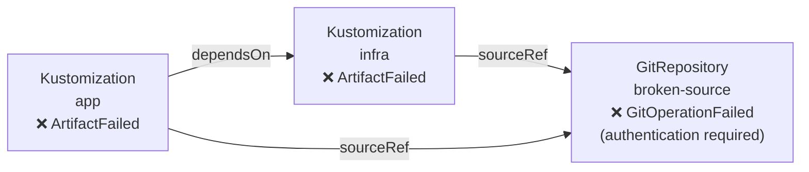
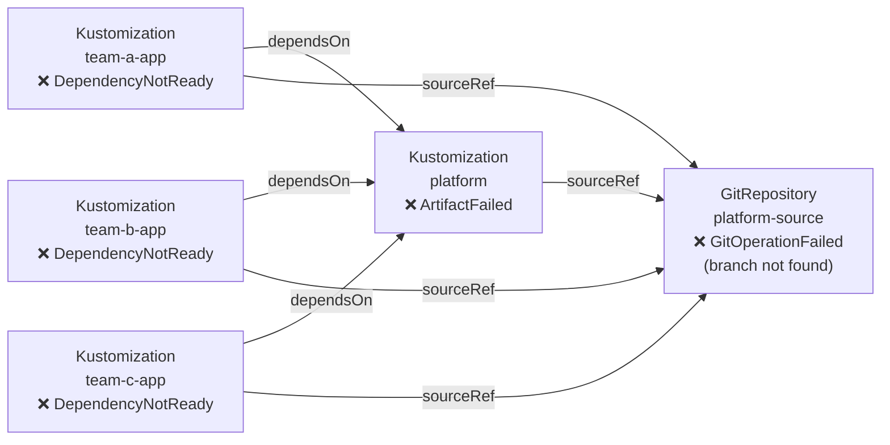
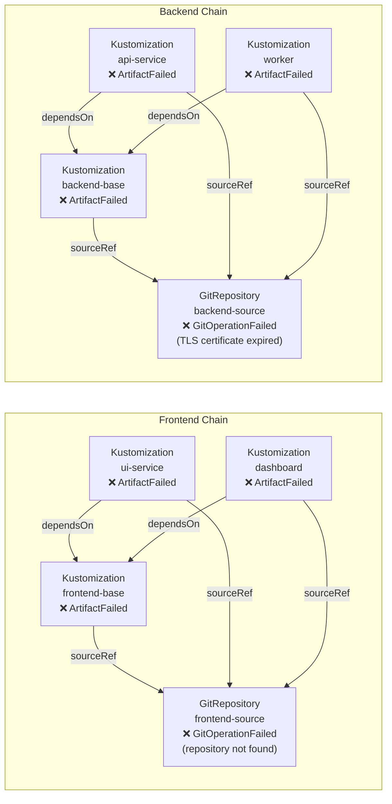
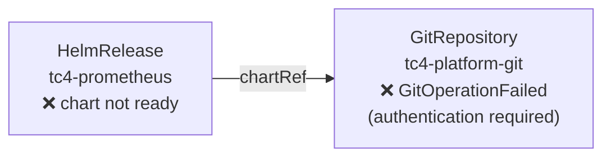
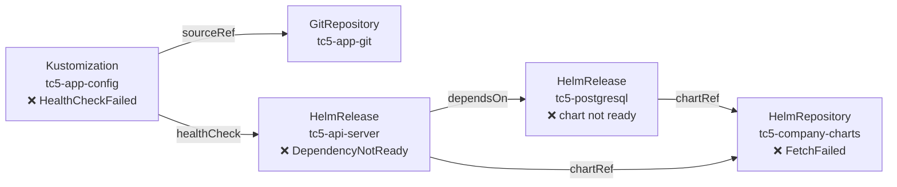
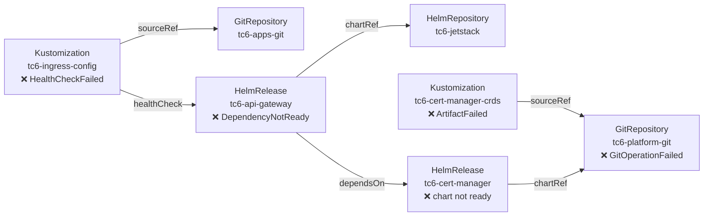

# Test Cases

Iteration 2 cases (1–3) cover pure Kustomization chains. Iteration 3 cases (4–6) introduce HelmRepositories and HelmReleases. All scripts are in `test/e2e/`.

---

## Iteration 2

---

## Test Case 1: Broken Source — Linear Chain

### Scenario

A GitRepository's deploy key has been rotated but the Flux secret has not been updated. Authentication fails on every sync attempt. A single Kustomization depends on this source; a second Kustomization depends on the first and also references the same source directly.

This is the most common Flux failure pattern: a single broken source causes a short linear cascade.

### Object Graph



### Failure State

```
NAME    READY   REASON              MESSAGE
infra   False   ArtifactFailed      Source artifact not found, retrying in 30s
app     False   ArtifactFailed      Source artifact not found, retrying in 30s
```

```
NAME            READY   REASON               MESSAGE
broken-source   False   GitOperationFailed   authentication required
```

### Expected Controller Output

One notification group fires (root cause: `broken-source`). `infra` and `app` reconcile near-simultaneously but the second is suppressed by the dedup window.

```json
{ "msg": "root cause", "details": {
    "trigger":  "app",
    "object":   "broken-source",
    "kind":     "GitRepository",
    "reason":   "GitOperationFailed",
    "message":  "authentication required",
    "duration": "~30s"
}}

{ "msg": "affected chain",
  "chain": "app(Kustomization) → infra(Kustomization) → broken-source(GitRepository)" }

{ "msg": "warning event", "object": "broken-source", "reason": "GitOperationFailed", "count": 1 }
```

### What This Validates

- Root cause correctly identified as the `GitRepository`, not the downstream `ArtifactFailed` Kustomizations
- Linear `dependsOn` + `sourceRef` traversal builds the correct 3-node graph
- Dedup collapses two reconciles into one notification

---

## Test Case 2: Shared Infrastructure Breakdown — Fan-Out

### Scenario

A platform team manages a shared `platform` Kustomization that bootstraps cluster-wide infrastructure (namespaces, RBAC, CRDs). Three separate application teams' Kustomizations each declare `dependsOn: platform`. The platform's source repository has had its main branch deleted.

Five objects fail simultaneously. This tests the controller's ability to correctly handle a fan-out topology without producing duplicate notifications or duplicate nodes in the graph.

### Object Graph



### Failure State

```
NAME          READY   REASON               MESSAGE
platform      False   ArtifactFailed       Source artifact not found, retrying in 30s
team-a-app    False   DependencyNotReady   dependency 'flux-system/platform' is not ready
team-b-app    False   DependencyNotReady   dependency 'flux-system/platform' is not ready
team-c-app    False   DependencyNotReady   dependency 'flux-system/platform' is not ready
```

### Expected Controller Output

One notification group (root cause: `platform-source`). All four failing Kustomizations reconcile; the first through notifies, the rest are suppressed. The `platform-source` node appears once in the graph despite being reachable via four different paths.

```json
{ "msg": "root cause", "details": {
    "trigger":  "team-a-app",
    "object":   "platform-source",
    "kind":     "GitRepository",
    "reason":   "GitOperationFailed",
    "message":  "branch not found",
    "duration": "~30s"
}}

{ "msg": "affected chain",
  "chain": "team-a-app(Kustomization) → platform(Kustomization) → platform-source(GitRepository)" }

{ "msg": "warning event", "object": "platform-source", "reason": "GitOperationFailed", "count": 1 }
```

### What This Validates

- `visited` map prevents `platform-source` appearing multiple times despite being reachable via 4 paths
- 4 reconcile events collapse to 1 notification via root-cause dedup
- `DependencyNotReady` Kustomizations are still captured as nodes, but the root cause points at the source
- Blast radius (`chain`) correctly shows the full 3-node path

---

## Test Case 3: Simultaneous Independent Failures — Two Chains

### Scenario

Two completely independent platform teams each have their own source repository. Both break at the same time for different reasons: the frontend source repository URL has changed (404), and the backend source has an expired TLS certificate. The failures are unrelated and should produce two independent notification groups.

This tests that the dedup key is per-root-cause and that two chains running in the same namespace don't bleed into each other.

### Object Graph



### Failure State

```
NAME             READY   REASON               MESSAGE
frontend-base    False   ArtifactFailed       Source artifact not found, retrying in 30s
ui-service       False   ArtifactFailed       Source artifact not found, retrying in 30s
dashboard        False   ArtifactFailed       Source artifact not found, retrying in 30s
backend-base     False   ArtifactFailed       Source artifact not found, retrying in 30s
api-service      False   ArtifactFailed       Source artifact not found, retrying in 30s
worker           False   ArtifactFailed       Source artifact not found, retrying in 30s
```

```
NAME              READY   REASON               MESSAGE
frontend-source   False   GitOperationFailed   repository not found: 404
backend-source    False   GitOperationFailed   tls: certificate has expired
```

### Expected Controller Output

Two notification groups, one per root cause. Frontend and backend notifications fire independently.

```json
{ "msg": "root cause", "details": {
    "object":   "frontend-source",
    "kind":     "GitRepository",
    "reason":   "GitOperationFailed",
    "message":  "repository not found: 404"
}}
{ "msg": "affected chain",
  "chain": "ui-service(Kustomization) → frontend-base(Kustomization) → frontend-source(GitRepository)" }
{ "msg": "warning event", "object": "frontend-source", "reason": "GitOperationFailed" }

{ "msg": "root cause", "details": {
    "object":   "backend-source",
    "kind":     "GitRepository",
    "reason":   "GitOperationFailed",
    "message":  "tls: certificate has expired"
}}
{ "msg": "affected chain",
  "chain": "api-service(Kustomization) → backend-base(Kustomization) → backend-source(GitRepository)" }
{ "msg": "warning event", "object": "backend-source", "reason": "GitOperationFailed" }
```

### What This Validates

- Two independent root causes produce two independent notification groups
- Chains do not bleed into each other (frontend nodes never appear in backend chain and vice versa)
- Dedup key is per-root-cause: suppressing `frontend-source` duplicates does not suppress `backend-source` notifications
- Controller handles 6 simultaneous failing Kustomizations and correctly partitions them

---

## Iteration 3

These cases define the acceptance criteria for iteration 3. In all three, HelmReleases and Kustomizations appear in the **same failure chain** — the way they are actually coupled in production.

> **Design correction (2026-06-12).** An earlier draft of these cases assumed cross-kind `dependsOn` (a HelmRelease depending on a Kustomization and vice versa). Flux does not support this on any version: the `dependsOn` reference has no `kind` field — HelmReleases can only depend on HelmReleases, Kustomizations on Kustomizations. Real clusters express cross-type coupling through two other mechanisms, which these cases now use:
>
> 1. **Chart from Git** — a HelmRelease's chart can be sourced from a GitRepository (`spec.chart.spec.sourceRef.kind: GitRepository`), so a broken Git source blocks Helm deployments directly.
> 2. **healthChecks** — a Kustomization can gate its readiness on arbitrary objects via `spec.healthChecks`, including HelmReleases. This is the standard pattern for making a config layer wait on a Helm-deployed service; on failure the Kustomization reports `HealthCheckFailed`.

> **Fixture quirk discovered on kind (2026-06-12).** A Kustomization whose health check target never becomes ready will, with default settings, *never stably report* `Ready=False`: with `interval: 30s` and a health check that itself takes `timeout: 30s` to fail, the next scheduled reconcile is already due the moment the current one fails, so `Ready=False/HealthCheckFailed` is overwritten with `Ready=Unknown/Progressing` within milliseconds (verified against kustomize-controller from Flux v2.4.0; the failure is visible only as Warning events). Fixtures that gate on healthChecks therefore set an explicit `retryInterval: 2m`, which gives the controller an idle window in which the failed state persists and is observable — by these tests and by any watcher, including flux-snapshot itself.

Key new traversal requirements:
- HelmRelease chart source is at `spec.chart.spec.sourceRef` (one level deeper than Kustomization's `spec.sourceRef`); its kind can be `HelmRepository` **or** `GitRepository`
- HelmRelease `spec.dependsOn` references other HelmReleases and becomes a `dependsOn` edge
- Kustomization `spec.healthChecks` entries that reference Flux kinds (HelmRelease) become `healthCheck` edges; entries for non-Flux kinds (Deployment, etc.) are ignored
- HelmReleases are now **triggers**: the controller watches them and builds a snapshot when one goes `Ready=False`
- New condition reasons appear: `HealthCheckFailed` (Kustomization), `DependencyNotReady` and chart-not-ready reasons (HelmRelease), `FetchFailed` (HelmRepository)
- The `chain` in the notification is the **path from trigger to root cause**, not an unordered node list — fan-in branches and healthy side nodes are in the snapshot but not in the chain string

---

## Test Case 4: Chart-from-Git HelmRelease Blocked by a Broken Git Source

### Scenario

A platform team deploys a monitoring chart **vendored in their platform GitRepository** (`spec.chart.spec.sourceRef.kind: GitRepository`) — the standard chart-from-git pattern for in-house charts. The GitRepository loses authentication and the HelmRelease `tc4-prometheus` can no longer build its chart.

This is deliberately the minimal forcing case for HelmRelease support: there is **no Kustomization anywhere in the fixture**, so a notification can only be produced if the controller watches HelmReleases as triggers and follows the chart source edge. (An earlier draft paired the HR with a Kustomization sharing the same source — that version passed against the iteration 2 controller because the KS trigger alone produced the expected output, masking the missing HR support. Cross-kind dedup is instead validated deterministically by TC6.)

### Object Graph



### Failure State

```
NAME             READY   REASON           MESSAGE
tc4-prometheus   False   ArtifactFailed   HelmChart 'flux-system/flux-system-tc4-prometheus' is not ready
```

```
NAME               READY   REASON               MESSAGE
tc4-platform-git   False   GitOperationFailed   authentication required
```

### Expected Controller Output

One notification group, triggered by the HelmRelease.

```json
{ "msg": "root cause", "details": {
    "trigger":  "tc4-prometheus",
    "object":   "tc4-platform-git",
    "kind":     "GitRepository",
    "reason":   "GitOperationFailed",
    "message":  "authentication required"
}}

{ "msg": "affected chain",
  "chain": "tc4-prometheus(HelmRelease) → tc4-platform-git(GitRepository)" }

{ "msg": "warning event", "object": "tc4-platform-git", "reason": "GitOperationFailed" }
```

### What This Validates

- HelmRelease is watched and acts as a snapshot trigger (impossible to pass with a Kustomization-only controller)
- `spec.chart.spec.sourceRef` with kind `GitRepository` is traversed as a source edge
- Root cause is the GitRepository, not the HelmRelease reporting the chart failure

---

## Test Case 5: HelmRepository Failure Cascades Through Two HelmReleases into a Kustomization

### Scenario

An app team runs their full stack via Helm from a self-hosted chart repository. `tc5-postgresql` deploys the database. `tc5-api-server` deploys the application API layer and declares `dependsOn: tc5-postgresql` so it only starts once the data layer is running. A Kustomization `tc5-app-config` deploys application configuration from a separate healthy GitRepository, and gates on the API being live with `healthChecks: [HelmRelease tc5-api-server]`. The self-hosted chart repository goes down. `tc5-postgresql` immediately fails to fetch its chart, `tc5-api-server` is blocked on its dependency, and `tc5-app-config` fails its health check.

The root cause is a HelmRepository and the failure propagates up through a HelmRelease chain into a Kustomization — the reverse direction from TC4.

### Object Graph



### Failure State

```
NAME             READY   REASON               MESSAGE
tc5-app-config   False   HealthCheckFailed    timeout waiting for: [HelmRelease/flux-system/tc5-api-server status: 'Failed']
```

```
NAME             READY   REASON               MESSAGE
tc5-postgresql   False   ArtifactFailed       HelmChart 'flux-system/flux-system-tc5-postgresql' is not ready
tc5-api-server   False   DependencyNotReady   dependency 'flux-system/tc5-postgresql' is not ready
```

```
NAME                 READY   REASON        MESSAGE
tc5-company-charts   False   FetchFailed   failed to fetch Helm repository index: no such host
```

### Expected Controller Output

One notification group. Both HelmReleases and the Kustomization reconcile as failed; all share the same root cause so only one notification fires.

```json
{ "msg": "root cause", "details": {
    "object":   "tc5-company-charts",
    "kind":     "HelmRepository",
    "reason":   "FetchFailed",
    "message":  "failed to fetch Helm repository index: no such host"
}}

{ "msg": "affected chain",
  "chain": "tc5-app-config(Kustomization) → tc5-api-server(HelmRelease) → tc5-postgresql(HelmRelease) → tc5-company-charts(HelmRepository)" }

{ "msg": "warning event", "object": "tc5-company-charts", "reason": "FetchFailed" }
```

(Chain shown for the `tc5-app-config` trigger; if a HelmRelease fires first, its sub-chain to `tc5-company-charts` is equally valid.)

### What This Validates

- Kustomization `spec.healthChecks` referencing a HelmRelease is traversed (cross-type `healthCheck` edge)
- Traversal continues recursively through the HelmRelease chain: `tc5-api-server` → `tc5-postgresql` → `tc5-company-charts`
- Both HelmReleases reference `tc5-company-charts` via chart sourceRef but the node appears once (visited map dedup)
- Root cause is the HelmRepository at the base, not the objects reporting `DependencyNotReady` or `HealthCheckFailed`
- The healthy `tc5-app-git` GitRepository is captured in the snapshot but is never selected as root cause
- 3 failing objects → 1 notification

---

## Test Case 6: Full Platform Stack — Four-Hop Mixed Chain

### Scenario

A production cluster bootstraps TLS infrastructure before deploying application services, all from one platform GitRepository. A Kustomization `tc6-cert-manager-crds` installs cert-manager CRDs from it. A HelmRelease `tc6-cert-manager` installs cert-manager from a chart **vendored in the same platform repository** (chart-from-git). A HelmRelease `tc6-api-gateway` deploys the API gateway from the healthy Jetstack chart repository and requires TLS, so it declares `dependsOn: tc6-cert-manager`. A Kustomization `tc6-ingress-config` deploys ingress rules from a separate healthy app GitRepository and gates on the gateway with `healthChecks: [HelmRelease tc6-api-gateway]`.

The platform GitRepository loses authentication. The CRDs Kustomization and the cert-manager HelmRelease fail immediately; everything above them is blocked. Four objects fail from a single root cause, propagating through alternating Kustomization and HelmRelease types.

### Object Graph



### Failure State

```
NAME                    READY   REASON               MESSAGE
tc6-cert-manager-crds   False   ArtifactFailed       Source artifact not found, retrying in 30s
tc6-ingress-config      False   HealthCheckFailed    timeout waiting for: [HelmRelease/flux-system/tc6-api-gateway status: 'Failed']
```

```
NAME               READY   REASON               MESSAGE
tc6-cert-manager   False   ArtifactFailed       HelmChart 'flux-system/flux-system-tc6-cert-manager' is not ready
tc6-api-gateway    False   DependencyNotReady   dependency 'flux-system/tc6-cert-manager' is not ready
```

```
NAME               READY   REASON               MESSAGE
tc6-platform-git   False   GitOperationFailed   authentication required
```

### Expected Controller Output

One notification group. The trigger is whichever failing object reconciles first; all subsequent reconciles share the same root cause key and are suppressed.

```json
{ "msg": "root cause", "details": {
    "object":   "tc6-platform-git",
    "kind":     "GitRepository",
    "reason":   "GitOperationFailed",
    "message":  "authentication required"
}}

{ "msg": "affected chain",
  "chain": "tc6-ingress-config(Kustomization) → tc6-api-gateway(HelmRelease) → tc6-cert-manager(HelmRelease) → tc6-platform-git(GitRepository)" }

{ "msg": "warning event", "object": "tc6-platform-git", "reason": "GitOperationFailed" }
```

(Chain shown for the `tc6-ingress-config` trigger. Note `tc6-cert-manager-crds` is a parallel branch into the same root cause: it appears in the snapshot graph, but not in this trigger's path string.)

### What This Validates

- 4-hop traversal across mixed object types in one chain: Kustomization → HelmRelease → HelmRelease → GitRepository, using both cross-type mechanisms (healthCheck edge and chart-from-git edge)
- Two healthy leaf nodes (`tc6-jetstack`, `tc6-apps-git`) are included in the snapshot but are NOT the root cause — `RootCause()` must select the leaf with `Ready=False`, not any leaf
- Fan-in: `tc6-cert-manager-crds` and `tc6-cert-manager` both resolve to `tc6-platform-git`, which appears once in the graph (visited map dedup)
- 4 failing objects from a single root cause → 1 notification
- Healthy side nodes do not pollute the chain or confuse root cause detection
